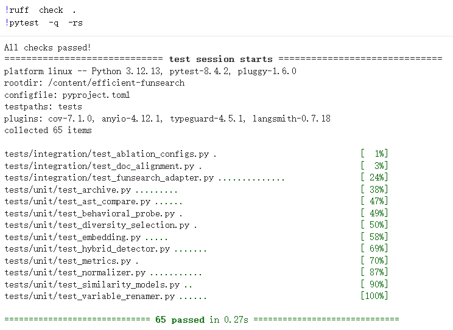

# CS5491 Project Milestone Report Draft

> Aligned with the course milestone requirements:
> 1) Problem description & motivation
> 2) Design of method/approach
> 3) Preliminary results

---

## 1. Project Information

- **Course**: CS5491
- **Project**: Sample-Efficient FunSearch via Behavioral Deduplication and Diversity-Guided Selection
- **Team members**: CHEN Sijie (59872908) & BIAN Wenbo (59872472)
- **Date**: 2026-03-31

---

## 2. Problem Description and Motivation

LLM-driven program search (e.g., FunSearch) often generates many behaviorally redundant candidates. Although these candidates may look syntactically different, they can make equivalent decisions on the target task. Evaluating such duplicates wastes API calls and compute, reducing sample efficiency.

Our project focuses on online bin packing and aims to improve search efficiency without sacrificing final solution quality. In our Phase 1 baseline experiment (53 samples, OR3 dataset, gpt-5-nano), we found that **45% of all evaluated programs produced scores identical to already-seen programs**, suggesting they are behaviorally redundant. This means nearly half of all LLM API calls and evaluation time are wasted on duplicate programs. We use two mechanisms:

1. Behavioral deduplication before full evaluation;
2. Diversity-guided selection to avoid early strategy collapse.

---

## 3. Design of Method / Approach

### 3.1 Pipeline Overview

Current v1 pipeline:

1. Candidate generation
2. Behavioral probing (5–15 probes)
3. Behavioral duplicate filtering (threshold > 0.95)
4. Full evaluation for non-duplicates
5. Archive update
6. Diversity-guided candidate selection

### 3.2 Behavioral Deduplication

We build deterministic behavioral fingerprints and compare them with archive fingerprints. Candidates above the similarity threshold are filtered before expensive evaluation.

Implemented modules:

- `src/similarity/behavioral_probe.py`
- `src/similarity/hybrid.py`
- `src/archive/program_archive.py`
- `src/integration/funsearch_adapter.py`

### 3.3 Diversity-Guided Selection

Candidate ranking uses a combined score:

`combined(c) = perf(c) + beta * diversity(c)`

Implemented modules:

- `src/similarity/diversity.py`
- `src/integration/funsearch_adapter.py`
- `src/metrics/efficiency_logger.py`

### 3.4 Metrics and Ablation

Metrics include sample efficiency, duplicate detection rate, convergence, and final quality. We define 4 ablation settings: `original`, `exact_string_match`, `normalized_hash_only`, `behavioral_plus_diversity`.

### 3.5 Benchmark Details

- **Primary benchmark**: OR-Library bin packing instances
- **Source**: http://people.brunel.ac.uk/~mastjjb/jeb/info.html
- **Data format**: text files (instance lines)
- **Current milestone scope**: small-to-medium OR-Library-style instances for quick preliminary runs

---

## 4. Preliminary Results

### 4.1 Baseline Experiment Setup

We ran a Phase 1 baseline experiment to characterize the natural duplicate rate and convergence behavior of unmodified FunSearch on the online bin packing task.

**Configuration:**

| Parameter | Value |
|-----------|-------|
| LLM Model | gpt-5-nano (reasoning model) |
| Dataset | OR3 (20 Online Bin Packing instances) |
| Total Samples | 53 (10 seeds + 43 LLM-generated) |
| Islands | 10 |
| Samples per Prompt | 4 |
| Evaluation Timeout | 30 s |
| Total Wall Time | ~40 min |

### 4.2 Key Findings

**Finding 1: 45% natural duplicate rate** — in only 53 samples, 45% of evaluations produced scores identical to already-seen programs. Nearly half of API calls and evaluation time are wasted on behaviorally redundant programs. This directly motivates our behavioral deduplication approach (Phase 2).

**Finding 2: Early convergence** — the search discovered near-optimal strategies by sample #8 (score ≈ −212.1), with fewer than 0.1-point improvement over the subsequent 45+ samples. This motivates diversity-guided selection (Phase 3).

**Finding 3: 100% success rate** — all 53 programs executed successfully and received valid scores, confirming infrastructure reliability.

### 4.3 Baseline Results

| Metric | Value |
|--------|-------|
| N_total (total programs) | 53 |
| N_unique (unique scores) | 29 |
| Sample Efficiency η | 0.55 |
| Natural Duplicate Rate | 0.45 |
| Best Score | −212.0 |
| Mean Score ± Std | −345.79 ± 122.02 |
| Convergence (improvement after sample #8) | < 0.1 |
| Avg Evaluation Time | 4.14 s/sample |
| Avg Sampling Time | 42.50 s/sample |

### 4.4 Engineering Validation

- `ruff check .` passed
- `pytest -q -rs` passed: **65 passed, 0 skipped**
- US1/US2/US3 paths covered by unit/integration tests

---

## 5. Reproducibility

```bash
ruff check .
pytest -q -rs
```

Expected:

- lint pass
- tests pass (currently 65 passed, 0 skipped)

### 5.1 Pre-submission Quality Gate Snapshot (2026-03-30)

- `ruff check .` → **All checks passed!**
- `pytest -q -rs` → **65 passed in 0.27s**

